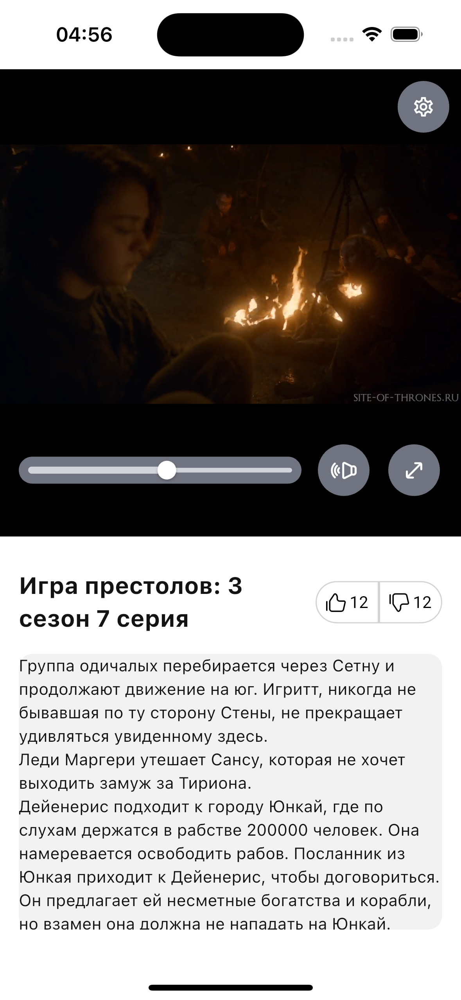
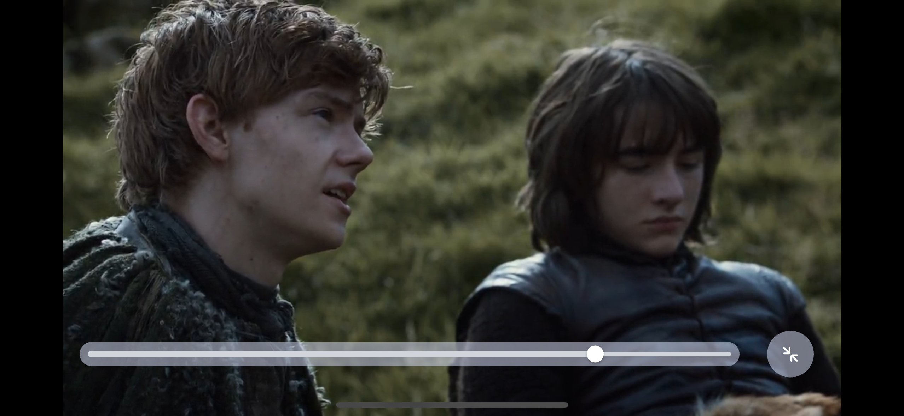

# Video Player

Небольшое Flutter-приложение с видеоплеером на базе `video_player` и управлением состоянием через `flutter_bloc`.

## Возможности

- Загрузка данных о видео из `MockVideoApi` (url, title, description)
- Воспроизведение/пауза
- Слайдер перемотки (seek)
- Mute / Unmute
- Скрывающаяся панель навигации (авто-скрытие через 1 секунду после play)
- Поддержка портретной и ландшафтной ориентации
- Полноэкранный режим (переход в landscape)
- Переключение темы (Light/Dark) из settings-панели

## Screenshots

  

## Стек

- Flutter
- `flutter_bloc` / `bloc`
- `video_player`
- `google_fonts`

## Архитектура и основные Bloc

### DataBloc
Отвечает за загрузку видео-модели из API.
### VideoBloc
Отвечает за play/pause, обновление текущей позиции (приходит из контроллера)
### VideoNavBloc
Отвечает за показ/скрытие центральной панели управления (play/back/next)

### ThemeBloc
Переключение темы
### SettingsBloc
Открытие/закрытие панели настроек:
### VolumeBloc
Mute/unmute
